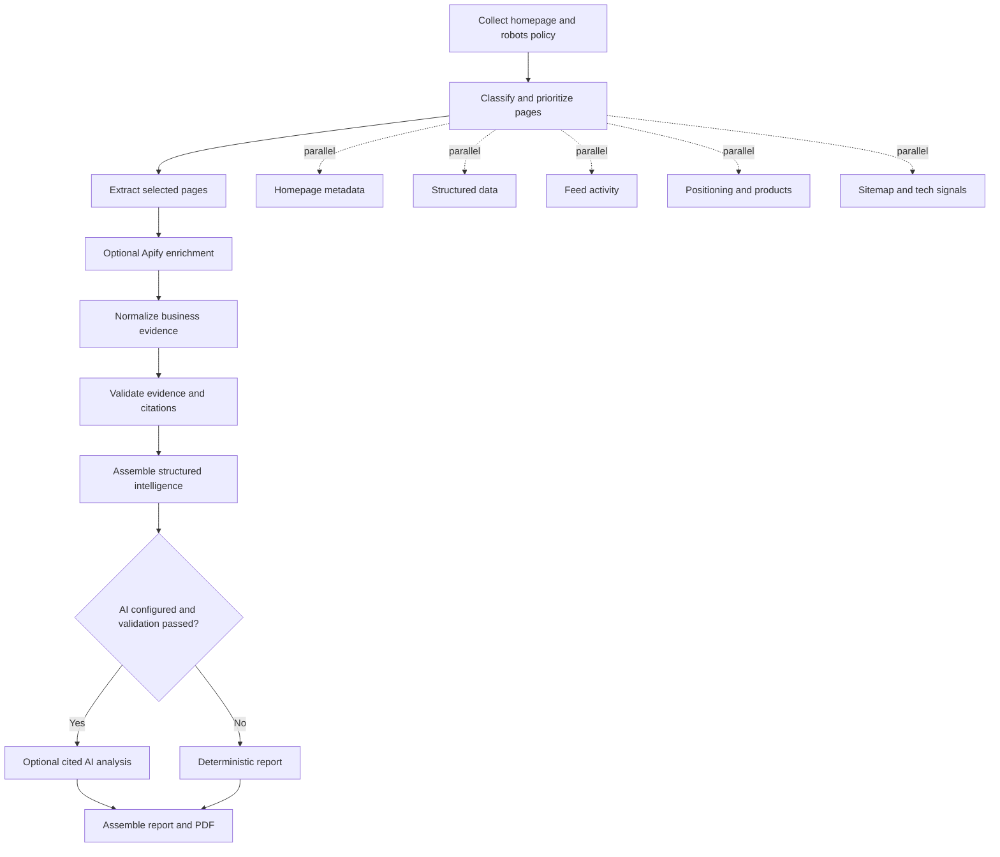
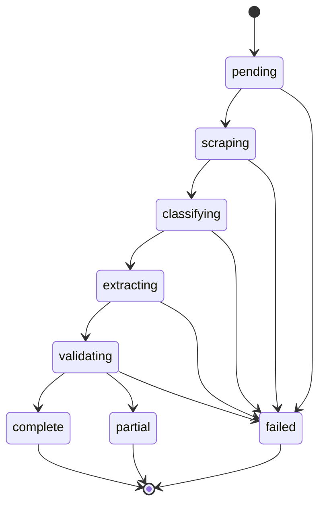

# Competitor Brief

Python-first MVP for a source-cited competitor research snapshot tool.

The first tool lives at `/tools/competitor-brief`. It accepts a competitor domain,
collects safe public signals, and renders a structured preview with a downloadable
full dossier.

## Principles

- Collect public, company-owned data first.
- Respect `robots.txt` and obvious access boundaries.
- Do not scrape LinkedIn, Indeed, login-only pages, CAPTCHA-protected pages, or paywalled pages.
- Every extracted item carries source URL, retrieval time, extractor name, confidence, and status.
- Normalized evidence uses stable content-derived citation IDs so unchanged facts keep the
  same references across runs.
- Missing data is shown as `Data unavailable`; it is never guessed.
- Optional AI analysis receives only normalized evidence and every statement must
  cite valid evidence IDs.

## Run With Docker

Docker Compose starts the FastAPI backend and Postgres with one command:

```powershell
docker compose up --build -d
```

Open `http://127.0.0.1:8000/tools/competitor-brief`.

Useful commands:

```powershell
# Check backend and database health
docker compose ps

# Follow backend logs
docker compose logs -f backend

# Stop the app while preserving database and report data
docker compose down

# Stop the app and permanently delete its local data
docker compose down -v
```

The first build installs Chromium for rendered-page fallback and can take several
minutes. Later starts reuse the built image. After changing dependencies or the
Dockerfile, rebuild with `docker compose up --build -d`.

To enable OpenRouter analysis, put your key in the ignored local `.env` file:

```dotenv
AI_API_KEY="your-openrouter-key"
```

The backend runs normally without that key and omits AI analysis.

### First Admin User

The app now requires login before testers can create, view, or download reports.
Seed the first admin by setting these values in your ignored local `.env` file
before the first startup:

```dotenv
AUTH_SECRET="replace-with-a-long-random-string"
USER_REPOSITORY="postgres"
ADMIN_NAME="Your Name"
ADMIN_EMAIL="you@example.com"
ADMIN_PASSWORD="temporary-strong-password"
```

When the user table is empty, the app creates this admin account automatically.
After login, open `/tools/competitor-brief/admin` to create named tester accounts
with name, email, password, and role.

To enable optional Apify enrichment, add:

```dotenv
APIFY_ENABLED="true"
APIFY_API_TOKEN="your-apify-token"
```

The first supported Apify actor set is intentionally small:

- `apify/instagram-scraper`
- `harvestapi/linkedin-company`
- `apify/google-search-scraper`
- `apify/website-content-crawler`

Apify output is treated as public evidence, not truth by default. The app converts
returned dataset items into observed claims with source URLs, then runs the same
normalization, validation, citation, and AI guardrails as website-scraped evidence.
When no token is configured, the deterministic website-only report still works.

## Run Tests With Docker

Run the deterministic test suite in an isolated container:

```powershell
docker compose run --build --rm tests
```

The test service disables AI, rendered-browser requests, and Postgres persistence,
so it does not spend API credits or change development data.

Run lint checks:

```powershell
docker compose run --build --rm tests python -m ruff check app tests
```

## Run Without Docker

```powershell
python -m venv .venv
.\.venv\Scripts\Activate.ps1
python -m pip install -e ".[dev]"
uvicorn app.main:app --reload
```

Open `http://127.0.0.1:8000/tools/competitor-brief`.

The crawler uses ordinary HTTP first. When an allowed page returns a sparse
JavaScript shell, it can use an identified, bounded Chrome rendering fallback.
Set `RENDERED_BROWSER_ENABLED=false` to disable it or change
`RENDERED_BROWSER_CHANNEL` when Chrome is not available.

The crawler performs a bounded second hop when first-pass pages expose links that
can answer still-unanswered business questions.

## Optional AI Analysis

The default AI provider is OpenRouter through its OpenAI-compatible endpoint. Add
credits and set `AI_API_KEY` or `OPENROUTER_API_KEY` to enable requests. Until then,
the deterministic report still completes without AI analysis.

```dotenv
AI_PROVIDER="openrouter"
AI_API_KEY=""
AI_BASE_URL="https://openrouter.ai/api/v1"
AI_MODEL="openai/gpt-5.4"
```

The model never collects facts: it receives a closed evidence JSON payload, must
return structured statements with citation IDs, and the server rejects unknown
citation IDs. The adapter first requests native structured output. If a compatible
model returns malformed structured data, it retries once with an explicit JSON
object contract and applies the same Pydantic and citation validation. AI calls
also retain cache, token, cost, and version guardrails.

Users choose the report type for each scan:

- **Free report:** deterministic extraction, validation, citations, and PDF.
- **AI analysis:** requests cited strategic analysis after validation and is priced
  as one credit.

The job stores this choice and the workflow obeys it. Credit balance management and
deduction are not implemented yet; those require the future authentication and
billing layer. A credit should only be deducted after AI analysis succeeds.

Operational AI details are intentionally hidden from customer dossiers. The admin
dashboard at `/tools/competitor-brief/admin` is restricted to admin users and shows
privacy-safe aggregates only: users, report counts, AI cost, Apify cost, and
per-user usage totals. It intentionally does not show competitor domains, evidence,
report contents, or direct report links.

## Optional Apify Enrichment

Apify enrichment runs after the first-party website crawl and before validation. It
adds social proof, company footprint, external mentions, and rendered-content fallback
signals when configured.

Current actor responsibilities:

- **Instagram Scraper:** public Instagram profile metadata, bio, post count, follower
  count, and recent post engagement.
- **HarvestAPI LinkedIn Company Details:** public company description, followers,
  employee count, industry, and location signals.
- **Google Search Results Scraper:** public third-party mentions and review/discussion
  discovery.
- **Website Content Crawler:** fallback content extraction for difficult public pages.

Customer-facing reports should summarize social comments as evidence-backed themes,
not dump personal commenter data. A public comment can support a claim only when the
original post URL is cited and the claim is labeled as an audience signal, not a
statistically proven market conclusion.

## Tests

```powershell
pytest
```

Run real-domain smoke checks separately from the deterministic unit suite:

```powershell
python scripts/live_smoke.py --show-claims nike.com adidas.com uhlsport.com
```

A content-page `401` or `403` remains `access blocked`; the crawler does not
impersonate another crawler or bypass access controls.

Generate the executive-summary PDF directly:

```powershell
python scripts/generate_report.py sologk.com --output output/pdf/sologk-snapshot.pdf
```

Run a small deterministic benchmark without AI charges:

```powershell
python scripts/run_benchmark.py --limit 3
```

The complete operational workflow for benchmarks, caching, budgets, run logs,
and usage tracking is documented in `docs/ai-operations-learning-guide.md`.
## Workflow And Jobs

The synchronous tool remains available at `/tools/competitor-brief`.

The application has two related control layers:

- The **workflow graph** defines the work performed and allows independent nodes
  to run concurrently.
- The **workflow state machine** enforces the required stage order and records
  timestamped transitions. Required stages cannot be skipped.

### Workflow Graph



Selected-page extraction is also concurrent but bounded to avoid excessive load
on competitor sites. Each registered node records its name, version, status,
duration, message, and failure policy:

- `fatal`: stop the workflow because a required result is unavailable.
- `partial`: keep validated results, but finish the workflow as `partial`.
- `optional`: record failure or skip status without invalidating the deterministic report.

### Workflow State Machine



`complete`, `partial`, and `failed` are terminal states. A `partial` report is
still a usable, source-cited report, but validation found missing or materially
failed collection steps. A `failed` workflow could not complete a required
stage. Validation always occurs before AI analysis and final report assembly.

For observable background-style processing:

```text
POST /tools/competitor-brief/jobs
GET  /tools/competitor-brief/jobs/{job_id}
GET  /tools/competitor-brief/jobs/{job_id}/report
```

Job records are stored under `JOB_STORE_DIR` and include workflow transitions, node runs,
validation results, extraction-result counts, and validated-fact counts. Completed jobs also
persist the typed snapshot, full dossier PDF, and evidence appendix. Opening a saved report
or downloading its PDFs reuses those artifacts instead of crawling the competitor again.

The full architectural rationale and extension points are documented in
[`docs/workflow-architecture.md`](docs/workflow-architecture.md).

The local JSON job store is intended for development and low-volume single-worker use.

Set `JOB_REPOSITORY=postgres`, `USER_REPOSITORY=postgres`, and `DATABASE_URL` to use
Postgres for both jobs and users. The schemas are initialized when the application
starts. Job ownership is enforced through the signed login session; users can only
see their own library, reports, downloads, feedback, and deletes.

When running only Postgres through Compose for a non-Docker backend, it uses
isolated host port `54329`:

```powershell
docker compose up -d postgres
docker compose ps
```

Completed reports expire after `REPORT_RETENTION_DAYS` and can be removed with:

```powershell
python scripts/cleanup_expired_jobs.py
```

The downloadable dossier contains the executive brief, the complete validated AI analysis
when requested, and the full evidence ledger. The standalone executive-summary renderer keeps
its former page limits so it remains suitable as the dossier cover.

Generate and score the three golden reports after report or extraction changes:

```powershell
python scripts/generate_golden_baselines.py
python scripts/score_golden_benchmarks.py
```

The current golden set targets citation validity and required-fact recall without AI.
